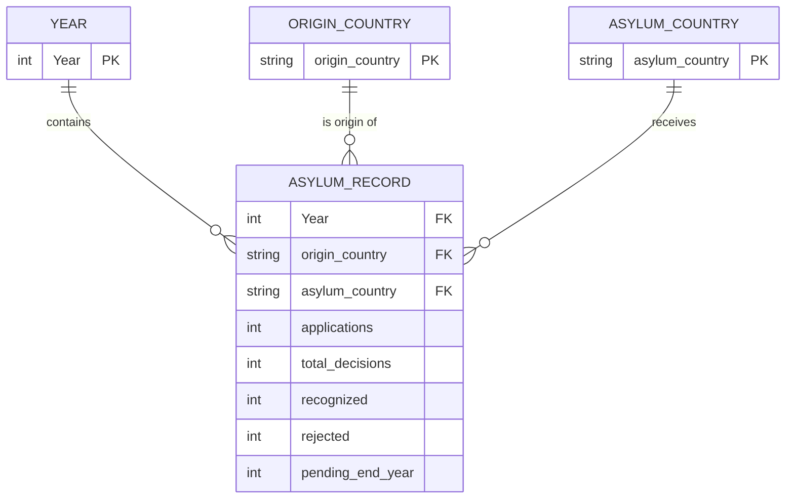
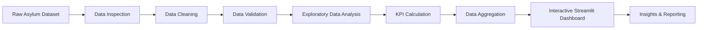

# Asylum Seeker Data Analysis & Dashboard

## 1. Project Overview

This project analyzes **asylum seeker and asylum decision data** to understand how asylum applications change over time, where applications originate, which countries receive them, how applications are processed, and how many cases remain pending.

The project combines **data cleaning, exploratory data analysis (EDA), KPI analysis, visualization, and Streamlit dashboard development**.

### Main questions

- How many asylum applications were submitted each year?
- Which countries have the largest number of asylum applications?
- Which countries receive the largest asylum caseload?
- Which countries have the largest pending caseload?
- How many cases receive decisions?
- What proportion of decisions are recognized or rejected?
- How do asylum applications and decisions change over time?
- What are the major origin-to-asylum-country patterns?

---

# 2. Database / Dataset Explanation

The project uses an asylum-seeker dataset containing records organized around three main concepts:

1. **Time** – the year in which the asylum activity occurred.
2. **Origin** – the country/territory from which the asylum seeker originates.
3. **Asylum / Residence** – the country/territory where asylum is requested or where the person resides.

The dataset also contains measures describing the asylum process:

- Applications submitted during the year
- Total decisions
- Recognized decisions
- Rejected decisions
- Pending cases at the end of the year

## 2.1 Main Dataset Structure

The main analytical table can be viewed as a fact table:

| Column | Description | Type |
|---|---|---|
| `Year` | Year of the asylum activity | Numeric / categorical |
| `Country / territory of origin` | Country or territory of origin | Categorical |
| `Country / territory of asylum/residence` | Country or territory where asylum is requested/residence is recorded | Categorical |
| `Applied during year` | Number of asylum applications submitted during the year | Numeric |
| `Total decisions` | Total number of asylum decisions made | Numeric |
| `decisions_recognized` | Number of decisions resulting in recognition | Numeric |
| `Rejected` | Number of rejected applications/decisions | Numeric |
| `Total pending end-year` | Number of cases pending at the end of the year | Numeric |

> **Note:** The exact meaning and coverage of individual fields should be interpreted according to the source metadata accompanying the original dataset.

---

# 3. Logical Database Model

The original data is stored as an analytical dataset rather than a fully normalized relational database. However, the columns can be modeled logically as several related entities.



### Relationship explanation

The logical relationships are:

```text
                    ┌──────────────┐
                    │     YEAR     │
                    └──────┬───────┘
                           │
                           │
                           ▼
┌────────────────┐   ┌───────────────┐   ┌────────────────────┐
│ ORIGIN COUNTRY │──▶│ ASYLUM RECORD │◀──│  ASYLUM COUNTRY    │
└────────────────┘   └───────────────┘   └────────────────────┘
                           │
                           │
              ┌────────────┼─────────────┐
              ▼            ▼             ▼
        Applications    Decisions      Pending
                           │
                     ┌─────┴─────┐
                     ▼           ▼
                 Recognized    Rejected
```

An **Asylum Record** therefore represents an observation for a particular:

> **Year + Origin Country + Asylum Country**

with the corresponding asylum-process measures.

---

# 4. Data Model

The central analytical table can be represented as:

```text
ASYLUM_RECORD
──────────────────────────────────────────────────────────
Year
Country / territory of origin
Country / territory of asylum/residence
Applied during year
Total decisions
decisions_recognized
Rejected
Total pending end-year
──────────────────────────────────────────────────────────
```

Conceptually:

```text
                 DIMENSIONS
        ┌──────────┬──────────────┐
        │          │              │
      Year       Origin      Asylum Country
        │          │              │
        └──────────┼──────────────┘
                   │
                   ▼
          ┌──────────────────┐
          │  ASYLUM RECORD   │
          └────────┬─────────┘
                   │
        ┌──────────┼─────────────┐
        │          │             │
        ▼          ▼             ▼
   Applications  Decisions    Pending
                    │
               ┌────┴────┐
               ▼         ▼
          Recognized   Rejected
```

This structure allows analysis from different dimensions without losing the relationship between origin, destination/asylum country, and year.

---

# 5. Data Preparation

The dataset was prepared before analysis to improve consistency and reliability.

Typical preparation steps include:

1. Loading the raw dataset.
2. Inspecting column names and data types.
3. Handling missing values.
4. Cleaning numeric columns.
5. Converting numeric measures to appropriate numeric types.
6. Standardizing country names where necessary.
7. Removing or handling invalid records.
8. Checking duplicate records.
9. Creating aggregated tables for analysis.
10. Preparing the cleaned dataset for visualization and Streamlit deployment.

Example analytical aggregation:

```python
yearly = df.groupby('Year').agg({
    'Applied during year': 'sum',
    'Total decisions': 'sum',
    'Total pending end-year': 'sum',
    'decisions_recognized': 'sum',
    'Rejected': 'sum'
}).reset_index()
```

---

# 6. Key Performance Indicators (KPIs)

The dashboard focuses on indicators that describe the asylum system.

## Total Applications

```text
Total Applications = Σ Applied during year
```

Measures the total number of asylum applications in the selected period.

## Total Decisions

```text
Total Decisions = Σ Total decisions
```

Measures the number of decisions made during the selected period.

## Recognition Rate

```text
Recognition Rate =
Recognized Decisions / Total Decisions × 100
```

Shows the percentage of recorded decisions that were recognized.

## Rejection Rate

```text
Rejection Rate =
Rejected Decisions / Total Decisions × 100
```

Shows the percentage of recorded decisions that were rejected.

## Decision Rate

```text
Decision Rate =
Total Decisions / Applications × 100
```

Provides an indication of the volume of decisions relative to applications during the selected period.

## Pending Caseload

```text
Pending Caseload =
Σ Total pending end-year
```

Shows the number of cases remaining pending at the end of the selected period.

---

# 7. Exploratory Data Analysis

The analysis contains both **univariate** and **multivariate** exploration.

## Univariate Analysis

Examples:

- Distribution of applications
- Distribution of decisions
- Distribution of pending cases
- Top countries of origin
- Top asylum countries
- Number of records by year

## Bivariate / Multivariate Analysis

Examples:

- Applications by year
- Applications by origin country
- Applications by asylum country
- Origin country vs asylum country
- Recognized vs rejected decisions
- Pending cases by asylum country
- Applications and decisions over time
- Origin-country trends over time

---

# 8. Main Visualizations

The Streamlit dashboard can include:

### 📈 Applications Over Time

Shows how asylum applications change by year.

```text
Applications
     │
     │        ╭──╮
     │   ╭────╯  ╰──╮
     │───╯          ╰──
     └──────────────────► Year
```

### 🌍 Top Countries of Origin

Ranks countries according to the number of applications.

### 🏛️ Top Asylum Countries

Ranks countries according to the asylum caseload they receive.

### ⚖️ Decision Outcomes

Compares:

- Recognized
- Rejected

### ⏳ Pending Caseload

Shows countries with the largest number of cases pending at the end of the year.

### 🗺️ Geographic Analysis

Where appropriate, a map can show asylum applications or pending cases by country.

---

# 9. Dashboard Filters

The Streamlit dashboard provides interactive filtering.

Recommended filters:

```text
┌──────────────────────────────┐
│ ASYLUM DASHBOARD FILTERS     │
├──────────────────────────────┤
│ Year                         │
│ Country of Origin            │
│ Asylum Country               │
└──────────────────────────────┘
```

By default, the dashboard can display **all years, all origin countries, and all asylum countries**.

Users can then select specific years or countries to dynamically update KPIs and visualizations.

---

# 10. Streamlit Dashboard Structure

A possible project structure is:

```text
Asylum-Seeker-Analysis/
│
├── data/
│   ├── raw/
│   │   └── asylum_raw.csv
│   └── processed/
│       └── cleaned_df.csv
│
├── notebooks/
│   └── asylum_eda.ipynb
│
├── app.py
│
├── pages/
│   ├── Overview.py
│   ├── Origin_Analysis.py
│   ├── Asylum_Countries.py
│   ├── Decisions.py
│   └── Data_Explorer.py
│
├── requirements.txt
│
└── README.md
```

---

# 11. Dashboard Pages

## 🏠 Overview

Contains:

- Total applications
- Total decisions
- Recognition rate
- Rejection rate
- Pending caseload
- Applications trend

## 🌍 Origin Analysis

Contains:

- Top origin countries
- Applications by origin
- Origin trends
- Origin-to-asylum-country analysis

## 🏛️ Asylum Countries

Contains:

- Top asylum countries
- Applications received
- Pending caseload
- Geographic comparison

## ⚖️ Decisions

Contains:

- Total decisions
- Recognized decisions
- Rejected decisions
- Recognition rate
- Rejection rate
- Decision trends

## 🔎 Data Explorer

Contains:

- Filterable dataset
- Selected columns
- Summary statistics
- Data-quality information

---

# 12. Example Decision-Outcome Visualization

A DataFrame can be prepared for the decision-outcome chart:

```python
decision_outcomes = pd.DataFrame({
    'Outcome': ['Recognized', 'Rejected'],
    'Count': [
        yearly['decisions_recognized'].sum(),
        yearly['Rejected'].sum()
    ]
})

fig = px.pie(
    decision_outcomes,
    names='Outcome',
    values='Count',
    hole=0.5,
    title='Asylum Decision Outcomes'
)

st.plotly_chart(fig, use_container_width=True)
```

---

# 13. Project Workflow



The overall process is:

```text
Raw Data
   ↓
Cleaning
   ↓
Validation
   ↓
EDA
   ↓
Aggregation
   ↓
KPI Calculation
   ↓
Visualization
   ↓
Streamlit Dashboard
   ↓
Insights
```

---

# 14. Example Insights

The final dashboard is designed to help identify insights such as:

- Changes in asylum applications across years.
- Countries producing the largest number of asylum applications.
- Countries receiving the largest asylum caseload.
- Countries with the largest pending caseload.
- Differences between recognized and rejected decisions.
- Changes in recognition and rejection rates.
- Important origin-to-asylum-country relationships.

Actual findings should be generated from the cleaned dataset rather than being hard-coded into the report.

---

# 15. Technologies Used

- **Python**
- **Pandas** – data manipulation and aggregation
- **NumPy** – numerical operations
- **Plotly** – interactive visualizations
- **Streamlit** – interactive dashboard
- **Jupyter Notebook** – exploratory data analysis
- **Git / GitHub** – project version control

---

# 16. How to Run the Project

### 1. Clone the repository

```bash
git clone <repository-url>
cd Asylum-Seeker-Analysis
```

### 2. Create/activate the environment

```bash
conda activate DA
```

Or use a Python virtual environment.

### 3. Install dependencies

```bash
pip install -r requirements.txt
```

### 4. Run Streamlit

```bash
streamlit run app.py
```

The dashboard will then open in the browser.

---

# 17. Project Objectives

The main objective is to transform raw asylum-seeker data into an **interactive analytical system** that makes asylum trends and decision outcomes easier to understand.

The project demonstrates the complete data-analysis workflow:

```text
              DATA ANALYSIS PIPELINE

     ┌──────────────┐
     │  Raw Dataset │
     └──────┬───────┘
            ↓
     ┌──────────────┐
     │ Data Cleaning│
     └──────┬───────┘
            ↓
     ┌──────────────┐
     │     EDA      │
     └──────┬───────┘
            ↓
     ┌──────────────┐
     │     KPIs     │
     └──────┬───────┘
            ↓
     ┌──────────────┐
     │ Visualization│
     └──────┬───────┘
            ↓
     ┌──────────────┐
     │   Streamlit  │
     │   Dashboard  │
     └──────┬───────┘
            ↓
     ┌──────────────┐
     │   Insights   │
     └──────────────┘
```

---

# 18. Conclusion

The **Asylum Seeker Data Analysis Project** provides an end-to-end example of using data analytics to understand asylum applications, decisions, recognition, rejection, and pending caseloads.

By connecting **year, origin country, and asylum country** with asylum-process measures, the project can provide a multidimensional view of asylum trends and support meaningful exploratory analysis through an interactive Streamlit dashboard.
